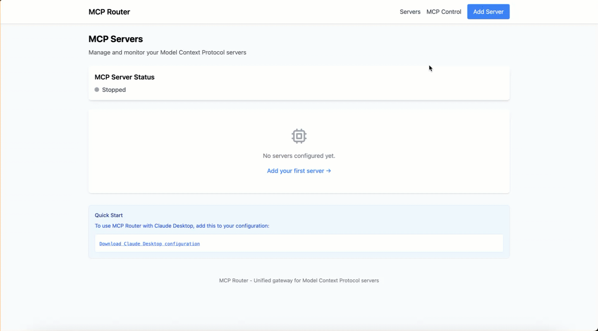

# MCP Router

A unified gateway for Model Context Protocol (MCP) servers with dual transport support, web management, intelligent routing, and containerized execution.



## What It Does

MCP Router provides:
- **Dual Transport Architecture**: Both HTTP (remote/production) and STDIO (local development) modes from a single application
- **Single Gateway**: Unified access to multiple MCP servers (no more juggling configs)
- **Web UI**: Server management with real-time status and configuration
- **Smart Routing**: Hierarchical tool discovery (prevents LLM tool overload)
- **Containerized Execution**: Docker-based isolation for all MCP servers
- **Production Ready**: OAuth 2.1 and API key authentication for remote access
- **Dynamic Authentication**: Switch between OAuth and API key authentication through the web UI

## Quick Start

### Deploy to Fly.io

```bash
# Install Fly CLI if you haven't already
curl -L https://fly.io/install.sh | sh
# or: brew install flyctl

# Clone and deploy
git clone https://github.com/locomotive-agency/mcp-router.git
cd mcp-router

# Create app and deploy
fly launch --no-deploy  # Configure without deploying
fly secrets set ADMIN_PASSCODE=your-secure-passcode
fly secrets set ANTHROPIC_API_KEY=sk-ant-your-key-here
fly deploy

# Note: The fly.toml is configured to clear the database on each deployment
# This ensures a fresh start with the Python Sandbox server pre-configured

# Access your deployment
# Web UI: https://your-app-name.fly.dev
# MCP endpoint: https://your-app-name.fly.dev/mcp/
```

### Local Development

```bash
# Clone repository
git clone https://github.com/locomotive-agency/mcp-router.git
cd mcp-router

# Install dependencies
pip install -r requirements.txt

# Configure environment
cp env.example .env
# Edit .env to add your ANTHROPIC_API_KEY and set ADMIN_PASSCODE

# HTTP Mode (Production-like, single port)
python -m mcp_router --transport http
# Access web UI: http://localhost:8000
# MCP endpoint: http://localhost:8000/mcp/

# STDIO Mode (Local development, background web UI)
python -m mcp_router --transport stdio
# Access web UI: http://localhost:8000 (background)
# Connect via Claude Desktop (stdio)

# Clear database on startup (useful for fresh starts)
python -m mcp_router --clear-db
```

## Configuration

### Essential Environment Variables

```bash
# Required
ADMIN_PASSCODE=your-secure-passcode    # Web UI authentication (min 8 chars)
ANTHROPIC_API_KEY=sk-ant-...          # For GitHub repo analysis

# Transport Mode (can be overridden with --transport flag)
MCP_TRANSPORT=http                     # "stdio" or "http" (default: http)

# Authentication Configuration
MCP_AUTH_TYPE=oauth                    # "oauth" or "api_key" (default: api_key)
MCP_API_KEY=auto-generated             # API key for authentication (auto-generated if not set)

# Server Configuration
FLASK_PORT=8000                        # Application port
MCP_PATH=/mcp                          # MCP endpoint path (HTTP mode)

# Container Configuration
DOCKER_HOST=unix:///var/run/docker.sock  # Docker socket location
MCP_PYTHON_IMAGE=python:3.11-slim       # Python image for uvx servers
MCP_NODE_IMAGE=node:20-slim             # Node.js image for npx servers
DOCKER_TIMEOUT=300                      # Docker operation timeout in seconds (default: 300)

# Database
DATABASE_URL=sqlite:///data/mcp_router.db  # Database location
```

## Usage

### 1. Add MCP Servers

Via Web UI:
1. Navigate to "Add Server"
2. Paste GitHub repository URL
3. Claude analyzes and configures automatically
4. Review and save

Supported runtime types:
- **npx**: Node.js/JavaScript servers
- **uvx**: Python servers  
- **docker**: Custom Docker containers

### 2. Connect Your Client

**STDIO Mode (Local Development):**

First, start MCP Router in STDIO mode:
```bash
python -m mcp_router --transport stdio
# Web UI available at http://localhost:8000 for management
```

Then configure Claude Desktop:
```json
{
  "mcpServers": {
    "mcp-router": {
      "command": "python",
      "args": ["-m", "mcp_router", "--transport", "stdio"]
    }
  }
}
```

**HTTP Mode (Remote/Production):**

For API Key authentication:
```python
from fastmcp import Client
from fastmcp.client.auth import BearerAuth

# Connect with API key
async with Client(
    "https://your-app.fly.dev/mcp/",
    auth=BearerAuth(token="your-api-key")
) as client:
    # List available servers
    providers = await client.call_tool("list_providers")
    
    # Use hierarchical tool discovery
    result = await client.call_tool(
        "search_code",
        provider="github-mcp-server",
        query="authentication"
    )
```

### 3. Test with MCP Inspector

Test your deployed MCP Router with the official MCP Inspector:

```bash
# Test HTTP mode with API key
npx @modelcontextprotocol/inspector https://your-app.fly.dev/mcp/

# Test local STDIO mode
npx @modelcontextprotocol/inspector python -m mcp_router --transport stdio
```

The web UI provides downloadable configuration files for Claude Desktop and MCP Inspector testing.

### 4. Dynamic Authentication Switching

In HTTP mode, you can switch between OAuth and API key authentication through the web UI:

1. Navigate to MCP Server Status → Connection Information
2. Use the toggle switch to change authentication type
3. Changes take effect immediately for new requests
4. No server restart required

## Architecture

### Dual Transport Design

```
┌─────────────────────────────────────────────────────────────────┐
│                    MCP Router Core Logic                        │
│  ┌─────────────┐ ┌──────────────┐ ┌──────────────────────────┐  │
│  │ SQLite DB   │ │ Router       │ │ Container Manager        │  │
│  │ (Servers)   │ │ Factory      │ │ (Docker)                 │  │
│  └─────────────┘ └──────────────┘ └──────────────────────────┘  │
└──────────────────────┬──────────────────────┬───────────────────┘
                       │                      │
        ┌──────────────▼──────────────┐      ┌▼──────────────────────┐
        │    HTTP Mode (Production)   │      │ STDIO Mode (Local Dev)│
        │                             │      │                       │
        │ ┌─────────────────────────┐ │      │ ┌───────────────────┐ │
        │ │ Starlette ASGI:         │ │      │ │ FastMCP stdio     │ │
        │ │ - Flask UI at /         │ │      │ │ (Main Thread)     │ │
        │ │ - FastMCP at /mcp       │ │      │ └───────────────────┘ │
        │ │ - Single Port 8000      │ │      │ ┌───────────────────┐ │
        │ └─────────────────────────┘ │      │ │ Flask UI          │ │
        │                             │      │ │ (Background)      │ │
        └─────────────┬───────────────┘      └───────┬───────────────┘
                      │                              │
        ┌─────────────▼───────────────┐    ┌─────────▼─────────────┐
        │   Web Browser/Claude Web    │    │    Claude Desktop     │
        │   (OAuth/API Key Auth)      │    │    (No Auth)          │
        └─────────────────────────────┘    └───────────────────────┘
```

### Key Components

- **ASGI Application**: Routes between Flask UI and FastMCP endpoints
- **MCPAuthMiddleware**: Handles OAuth 2.1 and API key authentication
- **Container Manager**: Manages Docker-based MCP server lifecycle
- **Router Factory**: Creates dynamic FastMCP routers with proxy configuration
- **Server Manager**: Provides status information and connection details

### Hierarchical Tool Discovery

1. **Initial**: Only `list_providers` and `python_sandbox` visible
2. **Discovery**: `list_providers()` returns available servers
3. **Server Tools**: Access via `provider` parameter
4. **Execution**: Routed to appropriate containerized server

## Development

### Running Tests
```bash
# Run all tests
pytest

# Run specific test categories
pytest tests/test_auth.py -v
pytest tests/test_container_manager.py -v
```

### Key Files
- `src/mcp_router/__main__.py` - Main entry point with transport selection
- `src/mcp_router/asgi.py` - ASGI application with authentication middleware
- `src/mcp_router/server.py` - FastMCP server implementation
- `src/mcp_router/app.py` - Flask web interface
- `src/mcp_router/container_manager.py` - Docker orchestration
- `src/mcp_router/mcp_oauth.py` - OAuth 2.1 provider implementation
- `src/mcp_router/models.py` - Database models with dynamic auth support

## Troubleshooting

**Port conflicts:**
```bash
# Change in .env
FLASK_PORT=8080
```

**Docker issues:**
```bash
# Verify Docker running
docker ps

# Clear containers
docker system prune -a
```

**Database issues:**
```bash
# Clear database and start fresh
python -m mcp_router --clear-db

# The Python Sandbox server will be automatically recreated
```

**Authentication failures:**
- Ensure `ADMIN_PASSCODE` is set (min 8 chars)
- Check API key in Connection Information panel
- Verify OAuth credentials if using OAuth mode
- Use the authentication type toggle to switch between methods

**Container runtime issues:**
- Ensure Docker daemon is running
- Check `DOCKER_HOST` environment variable
- Verify container images are available (`docker pull python:3.11-slim`)

## Contributing

Focus areas:
1. Additional OAuth provider support
2. Performance optimizations
3. Enhanced security features
4. Container runtime improvements

## License

See LICENSE